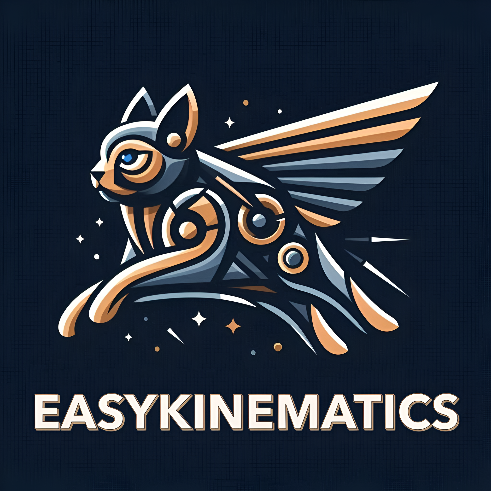

# 🧠 **Easy Kinematics**

<!-- Logo del proyecto (reemplazar URL) -->

  

---

## 📑 **Índice**

- [🔍 Descripción](#🔍-descripción)
- [📎 Documentación](#📎-documentación)
- [🎯 Objetivos](#🎯-objetivos)
- [📋 Requerimientos](#📋-requerimientos)
- [📏 Límites](#📏-límites)
- [📊 Alcance](#📊-alcance)
- [💻 Tecnologías](#💻-tecnologías)
- [📸 Vista Previa](#📸-vista-previa)
- [⚙️ Stack Tecnológico](#⚙️-stack-tecnológico)
- [📢 Autora](#📢-autora)

---

<h2 id="🔍-descripción">🔍 Descripción</h2>

Easy Kinematics (Cinemática Simplificada) es una herramienta educativa diseñada para ayudar a los estudiantes a comprender y resolver problemas de **Movimiento Rectilíneo Uniforme (MRU) y Movimiento Rectilíneo Uniformemente Acelerado (MRUA)**. Su propósito es facilitar el aprendizaje autónomo mediante una interfaz intuitiva que guía a los usuarios a través de la teoría y cálculos paso a paso.

### **Problema Principal que Soluciona**

Los estudiantes suelen enfrentar dificultades en la comprensión de la cinemática debido a la falta de recursos claros y didácticos. Easy Kinematics aborda este problema proporcionando una plataforma estructurada con explicaciones detalladas y automatización de cálculos.

### **Beneficios Clave**

- 📖 **Aprendizaje:** Explicaciones detalladas de los conceptos.
- ⚡ **Automatización de cálculos:** Permite ingresar variables personalizadas y obtener resultados precisos.
- 🔄 **Flexibilidad:** Soporte para diferentes unidades de medida.

---

<h2 id="📎-documentación">📎 Documentación</h2>

Adjunto la documentación completa del proyecto:

- [Documentación en Word](./docs/TP%20N°1%20-%20VictoriaVMC.docx)
- [Documentación en Pdf](./docs/TP%20N°1%20-%20VictoriaVMC.pdf)
- [Diseño Web](./docs/Easy%20Kinematics%20Responsive.pdf)

---

<h2 id="🎯-objetivos">🎯 Objetivos</h2>

### **Generales**

Brindar una herramienta de aprendizaje que permita comprender, resolver y visualizar problemas de cinemática básica, reforzando el aprendizaje autónomo.

### **Específicos**

- Diseñar una interfaz intuitiva y fácil de usar.
- Implementar un sistema de conversión de unidades (km a m, km/h a m/s).
- Facilitar la resolución de problemas de cinemática mediante guías paso a paso.

---

<h2 id="📋-requerimientos">📋 Requerimientos</h2>

### 🔧 **Funcionales**

- **Módulo de Problema de los Trenes:**

  - Calcular el tiempo y punto de encuentro.
  - Opción para definir si un tren tiene prioridad en el cálculo.
  - Selección de unidades para distancia y velocidad.

- **Módulo de Problema del Proyectil:**
  - Calcular alcance y tiempo de caída.
  - Opción para seleccionar unidades de velocidad inicial y altura.

### 🚀 **No Funcionales**

- **Rendimiento:** Procesamiento eficiente de cálculos.
- **Escalabilidad:** Arquitectura modular para futuras mejoras.
- **Usabilidad:** Interfaz clara con explicaciones detalladas.

---

<h2 id=" 📏-límites">📏 Límites</h2>

- No se definirá prioridad para ningún tren en el cálculo de trayectorias o tiempos.
- No se contemplarán salidas asincrónicas de los trenes; es decir, ambos trenes seguirán un esquema de salida predefinido.
- El sistema permitirá un máximo de dos trenes en operación simultánea.
- Se considerará únicamente un trayecto con dos estaciones: una de origen y otra de destino (A → B y B → A).
- No se abordarán otros tipos de movimientos, como dinámica o rotación de los trenes. - - -
- La aplicación estará diseñada para ejecutarse en un entorno local, sin disponibilidad como servicio web público.
- No se implementará una base de datos; los cálculos se realizarán en tiempo real sin almacenamiento de información.
- No se podrá hacer visualización gráfica de movimientos.

---

<h2 id=" 📊-alcance">📊 Alcance</h2>

- 📘 Explicación teórica de MRU y MRUA.
- 🚆 Resolución del problema de encuentro entre trenes (MRU).
- 🎯 Resolución del problema de trayectoria y tiempo de impacto de un proyectil en tiro parabólico horizontal (MRUA).

---

<h2 id=" 💻-tecnologías">💻 Tecnologías</h2>

Para el desarrollo de este proyecto se utilizó Python, ya que es uno de los lenguajes más óptimos para cálculos matemáticos y científicos. Facilita el manejo de operaciones algebraicas, ecuaciones diferenciales y cálculos simbólicos, lo que resulta esencial para la resolución de problemas cinemáticos.

Además, se adoptó un enfoque basado en funciones reutilizables, lo que permite modularizar el código y evitar redundancias. Esto mejora la legibilidad, facilita la depuración y permite la escalabilidad del sistema. Cada cálculo clave, como la velocidad, aceleración o trayectoria, fue encapsulado en funciones específicas, lo que permite reutilizar la lógica en diferentes partes del proyecto sin necesidad de duplicar código.

### **Arquitectura**

- Backend desarrollado en **Python con Flask**.
- Frontend basado en **templates de TemplateMonster**.

### **Herramientas**

- 🔄 Control de versiones con **Git**.
- 📄 Manejo de datos en **JSON**.
- 🎨 Estilos de **TemplateMonster**. Presenta **Bootstrap, CSS y HTML**.
- 📜 Scripts dinámicos con **JavaScript**.

---

<h2 id=" 📸-vista-previa">📸 Vista Previa</h2>

  <b>Head</b> 
  

  <b>Index - Caso 1 (Trenes)</b> 
  

  <b>Index - Caso 2 (Movimiento Parabólico Horizontal)</b> 
  

  <b>Caso 1 - Trenes</b> 
  

  <b>Calculadora - Trenes</b> 
  

  <b>Caso 2 - Movimiento Parabólico Horizontal</b> 
  

  <b>Calculadora - Movimiento Parabólico Horizontal</b> 
  

---

<h2 id=" ⚙️-stack-tecnológico">⚙️ Stack Tecnológico</h2>

<!-- Muestro con badges: -->

  
  
  
  
  
  
  

---

<h2 id=" 📢-autora">📢 Autora</h2>

<table>
  <tr>
    <!-- Añadir más colaboradores -->
    <td align="center">
      <a href="https://github.com/victoriavmc">
         
        <b>Victoria VMC</b>
      </a>
    </td>
  </tr>
</table>
